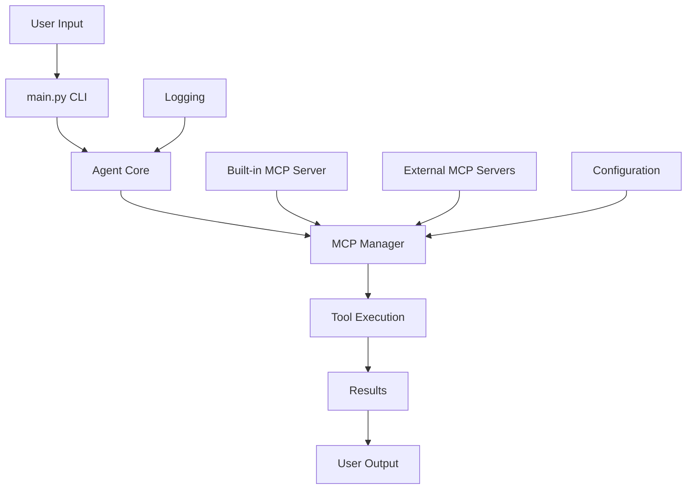
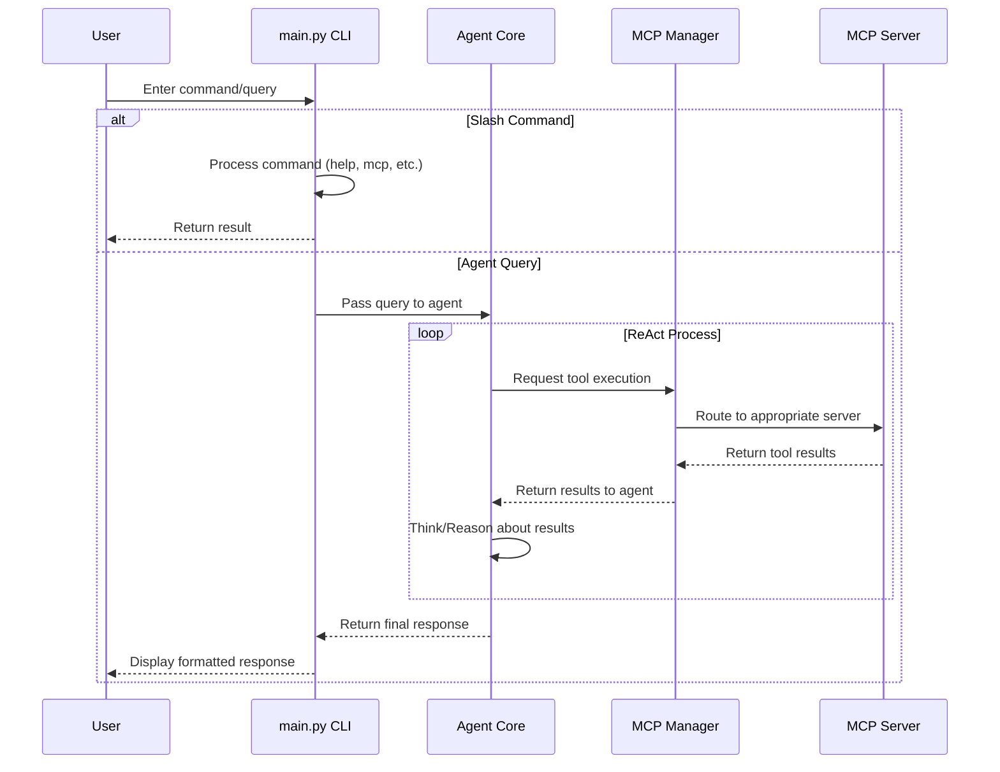
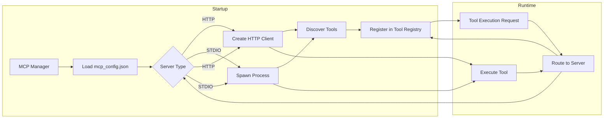
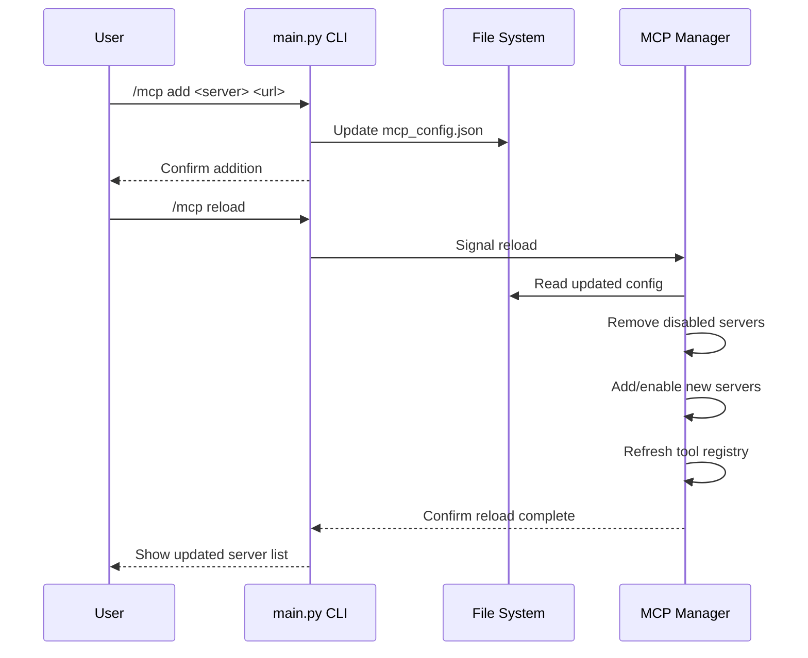

# Agent Architecture Documentation

## System Architecture Overview

### Component Descriptions

| Component | Description |
|-----------|-------------|
| **main.py CLI** | Command-line interface that processes user input and slash commands |
| **Agent Core** | Central orchestration loop that manages the ReAct reasoning process |
| **MCP Manager** | Handles MCP server connections, tool discovery, and request routing |
| **Tool Execution** | Executes tools (both built-in and MCP-provided) |
| **Results** | Processed outputs from tool executions |
| **User Output** | Formatted responses displayed to the user |
| **Built-in MCP Server** | Internal server providing agent's native capabilities (runs on http://localhost:8000/mcp) |
| **External MCP Servers** | User-configured external MCP servers (HTTP or STDIO) |
| **Configuration** | MCP server settings loaded from mcp_config.json |
| **Logging** | System logging for debugging and monitoring |

## Data Flow Diagrams

### Basic Request Processing Flow

### MCP Server Connection Flow

### Configuration Update Flow

## Key Features

### 1. MCP Server Management
- Supports both HTTP and STDIO MCP server types
- Dynamic addition/removal without restart
- Built-in server protection (cannot be removed)
- Conflict resolution (first server wins for duplicate tools)

### 2. Tool Routing
- Centralized MCP Manager handles all tool requests
- Transparent routing to appropriate server
- Consistent interface regardless of server type
- Error handling and fallback mechanisms

### 3. Configuration Persistence
- JSON-based configuration (mcp_config.json)
- Example configuration provided (mcp_config.example.json)
- Runtime updates through slash commands
- Validation and error reporting

### 4. Extensibility
- Easy to add new MCP servers
- Standard MCP protocol compliance
- Community tool sharing capability
- Future-proof design

## Security Considerations

1. **Built-in Server Protection**: Cannot be removed via MCP commands
2. **Input Validation**: All MCP commands validate parameters
3. **Process Isolation**: STDIO servers run in separate processes
4. **Network Safety**: HTTP servers only connect to configured endpoints
5. **Tool Sandboxing**: MCP protocol limits tool capabilities